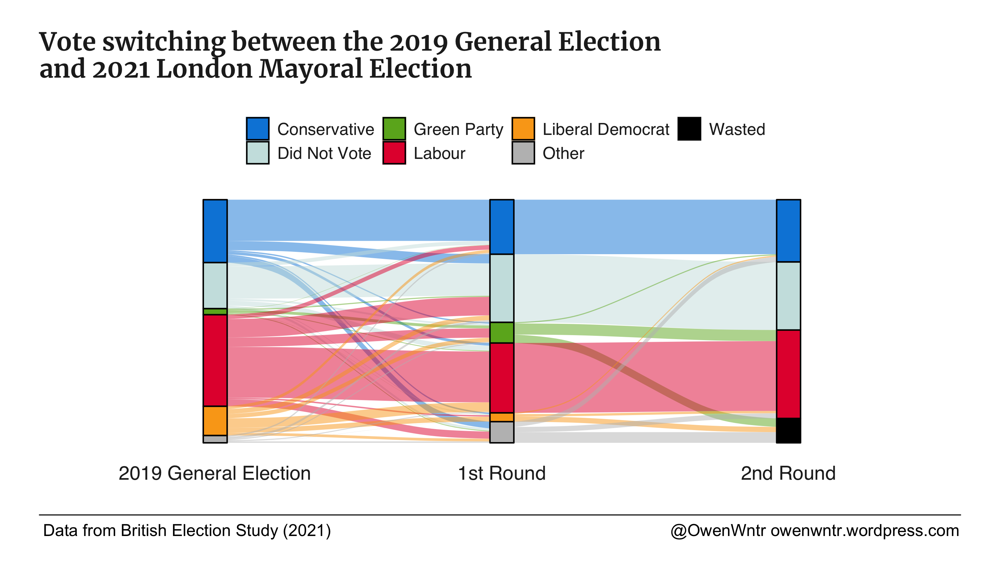

# Tracking Voters between the 2019 General Election and 2021 Metro Mayor Elections

This repository include replication code and data created using the British Election Study to look at flows between the 2019 General Election and 2021 Metro Mayor Elections. I look at the results in my blog [here](https://owenwntr.wordpress.com/2022/01/31/2021-metro-mayor-elections-labour-narrowly-gained-from-the-conservatives-while-losing-to-did-not-vote/). The flow plots are made with [ggalluvial](https://cran.r-project.org/web/packages/ggalluvial/vignettes/ggalluvial.html).

### British Election Study

-   **Data:** Fieldhouse, E., J. Green, G. Evans, J. Mellon & C. Prosser, J. Bailey (2020) *British Election Study Internet Panel Waves 1-21*. Available here: https://www.britishelectionstudy.com/data-objects/panel-study-data/

### R Packages

- **ggalluvial:** Brunson JC (2020). “ggalluvial: Layered Grammar for Alluvial Plots.” *Journal of Open Source Software*, 5(49), 2017. doi: 10.21105/joss.
- **pano:** Hanretty, C. (2016). "pano" https://github.com/chrishanretty/pano
- **pollster:** Johnson, J. D. (2020). "Weighted data survey tables in R" https://cran.r-project.org/package=pollster

